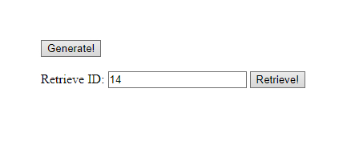

# Random number REST
REST API for random number generation and retrieveing results by ID.

## Install
Clone this repository and install dependencies:
```sh
composer install
```

## Usage
Start local server:
```sh
php -S localhost:5555 -t public 
```
<br>

Generate random number:
```sh
curl -v localhost:5555/generate
```
OR
```sh
curl -v -X POST localhost:5555/generate
```
<br>

Retrieve result by ID:
```sh
curl -v localhost:5555/retrieve/<ID>
```
<br>
API responses in JSON.

You can also open `localhost:5555` in browser and use GUI.


